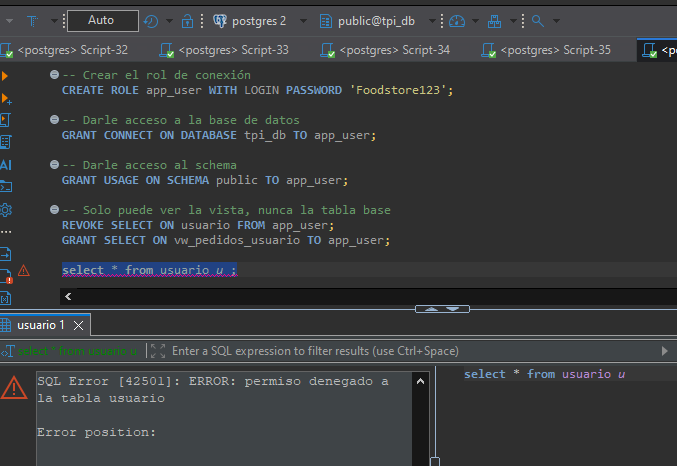
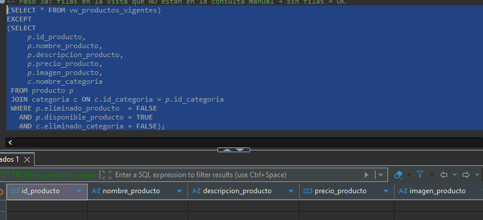
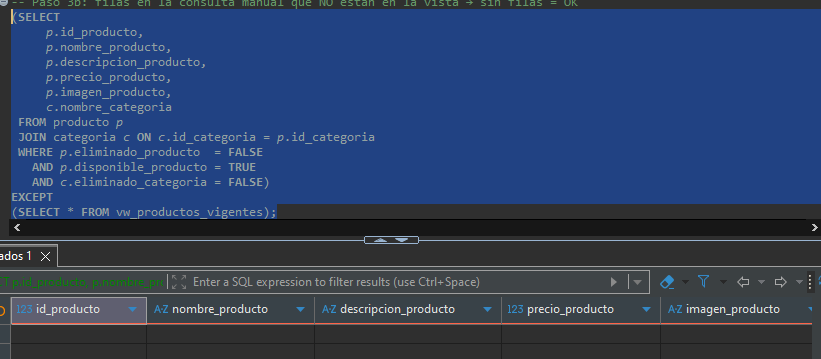
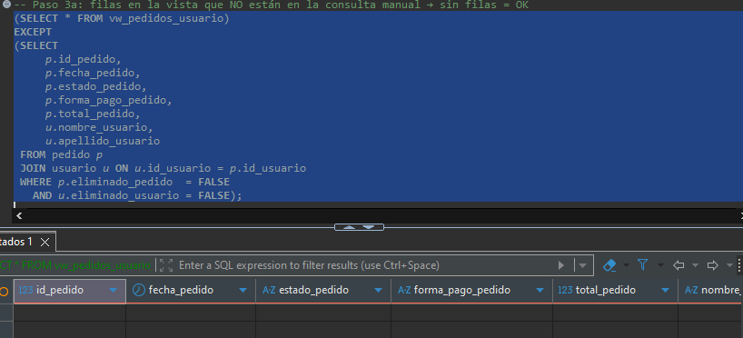
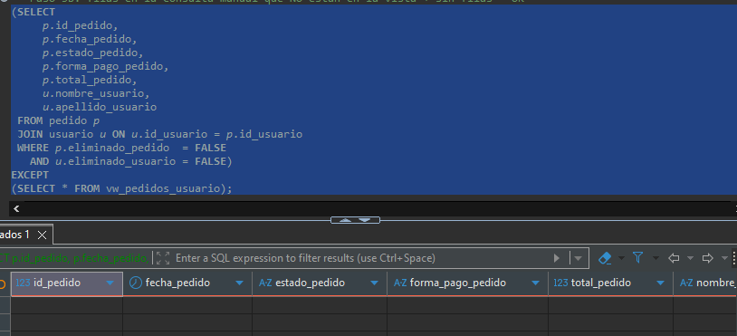
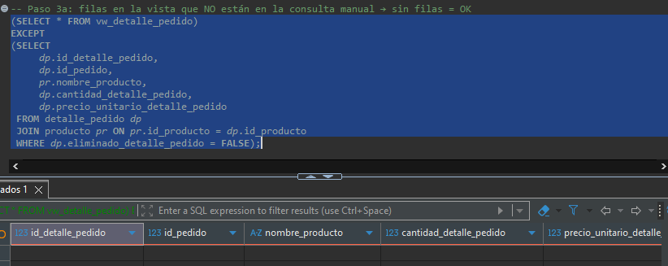
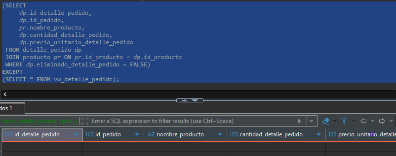

# Informe de Mediciones — Food Store
## TP Unidad 3 Semana 1 — Índices, vistas y vistas materializadas

---

## Parte A — Índices (resumen)

> Detalle completo con planes de ejecución, capturas y justificación en
> `Parte_A_BASE_DE_DATOS.docx`. Se deja aquí el resumen para que
> `informe_mediciones.md` reúna las tres partes en un solo documento,
> tal como pide el punto 4 de la consigna.

| Consulta | Antes (sin índice) | Índice creado | Después (con índice) |
|---|---|---|---|
| Pedidos `PENDIENTE` ordenados por fecha | Seq Scan, 150.171 filas descartadas, Sort en memoria, **1627 ms** | `idx_pedido_estado_fecha` — B-Tree compuesto y parcial `(estado_pedido, fecha_pedido DESC) WHERE eliminado_pedido = FALSE` | Bitmap Index Scan, 2.061→193 bloques leídos, **~101 ms** (mejora >90%) |
| Búsqueda de producto por nombre (`LIKE 'pizza%'`) | Seq Scan sobre 50.002 filas, **370,97 ms** | `idx_producto_nombre_lower` — B-Tree funcional `lower(nombre_producto) varchar_pattern_ops` | Bitmap Index Scan, **0,207 ms** |
| Detalles de un pedido (`id_pedido = 12500`) | Ya resuelta con Index Scan por `detalle_pedido_id_pedido_id_producto_key` (índice del `UNIQUE(id_pedido, id_producto)` de `schema.sql`) | **Ninguno** — ver corrección abajo | Sin cambios: mismo plan y mismo tiempo (~0,05–0,1 ms), con o sin índice nuevo |

**Costo en escrituras:** carga masiva de 500 INSERT en `detalle_pedido`
— **12,10 ms** de promedio antes de los índices vs. **18,40 ms**
después (+52%). Se considera aceptable porque el sistema lee muchísimo
más de lo que escribe.

**Propuestas descartadas por sobreindexación:**

1. Índice B-Tree individual sobre `pedido(forma_pago_pedido)`. Se
   descartó porque la columna tiene baja cardinalidad (solo 3 valores
   posibles), así que el planificador preferiría igual un `Seq Scan`;
   el índice solo agregaría espacio en disco y penalizaría los
   `INSERT` sin beneficio real en las lecturas.
2. **(Corrección posterior)** `idx_detalle_pedido_id_pedido` sobre
   `detalle_pedido(id_pedido)`, propuesto originalmente para la
   Consulta 3. Al revisar el `schema.sql` se detectó que la tabla ya
   tiene un índice compuesto `(id_pedido, id_producto)` por la
   restricción `UNIQUE`, que por la regla del prefijo izquierdo ya
   cubre cualquier filtro por `id_pedido` solo. Se verificó ejecutando
   la Consulta 3 con y sin el índice nuevo: mismo plan
   (`Index Scan using detalle_pedido_id_pedido_id_producto_key`) y
   mismo tiempo en ambos casos. `indices.sql` se corrigió para no
   crear este índice — el CREATE INDEX queda comentado, documentando
   qué se descartó y por qué. Detalle completo en `duia.md`.

---

## Parte B — Vistas

---

## 1. Especificación utilizada

### Objetivo

Crear las vistas SQL necesarias para dar soporte a los reportes habituales de la aplicación
Food Store, asegurando una estructura limpia, filtros de negocio consistentes y protección
de datos sensibles.

### Reglas Generales y Seguridad

**Filtro de Vigencia:**
Los productos vigentes deben filtrarse usando `eliminado_producto = FALSE` y `disponible_producto = TRUE`. Las categorías asociadas con `eliminado_categoria = FALSE`. Los pedidos con `eliminado_pedido = FALSE`. Los usuarios con `eliminado_usuario = FALSE`. Los detalles con `eliminado_detalle_pedido = FALSE`.

**FKs internas:**
No exponer columnas de clave foránea como valores numéricos. Reemplazarlas por el valor descriptivo obtenido mediante JOIN (ej: `nombre_categoria` en lugar de `id_categoria`).

**Seguridad y Privacidad — columnas excluidas globalmente:**

| Columna | Motivo |
|---|---|
| `eliminado_*` | Control de baja lógica, sin valor para el reporte |
| `created_at_*` | Metadatos técnicos de auditoría interna |
| FK numéricas | Reemplazadas por el valor descriptivo del JOIN |
| `stock_producto` | Dato operativo interno, no exponer al público |
| `disponible_producto` | Control interno (el filtro ya lo resuelve) |
| `contrasena_usuario` | Dato sensible, NUNCA exponer |
| `mail_usuario` | Dato personal, excluir por privacidad |
| `rol_usuario` | Dato de control interno |

---

### Vista 1 — `vw_productos_vigentes`

**Propósito:** Mostrar el catálogo activo de productos junto con su categoría asociada. Orientada al frontend público y reportes de operaciones.

**Tablas:** `producto JOIN categoria ON categoria.id_categoria = producto.id_categoria`

**Filtro:**
```sql
WHERE producto.eliminado_producto  = FALSE
  AND producto.disponible_producto = TRUE
  AND categoria.eliminado_categoria = FALSE
```

**Columnas excluidas:** `id_categoria`, `stock_producto`, `eliminado_producto`, `disponible_producto`, `created_at_producto`, `eliminado_categoria`, `created_at_categoria`

**Columnas expuestas:** `id_producto`, `nombre_producto`, `descripcion_producto`, `precio_producto`, `imagen_producto`, `nombre_categoria`

---

### Vista 2 — `vw_pedidos_usuario`

**Propósito:** Listar pedidos con los datos principales del cliente. Orientada a gestión y atención al cliente, sin exponer credenciales ni datos personales.

**Tablas:** `pedido JOIN usuario ON usuario.id_usuario = pedido.id_usuario`

**Filtro:**
```sql
WHERE pedido.eliminado_pedido    = FALSE
  AND usuario.eliminado_usuario  = FALSE
```

**Columnas excluidas:** `id_usuario`, `contrasena_usuario`, `mail_usuario`, `rol_usuario`, `eliminado_usuario`, `created_at_usuario`, `eliminado_pedido`, `created_at_pedido`

**Columnas expuestas:** `id_pedido`, `fecha_pedido`, `estado_pedido`, `forma_pago_pedido`, `total_pedido`, `nombre_usuario`, `apellido_usuario`

---

### Vista 3 — `vw_detalle_pedido`

**Propósito:** Desglosar los ítems de cada pedido incluyendo el nombre del producto. Orientada a tickets, cocina y reportes de ventas.

**Tablas:** `detalle_pedido JOIN producto ON producto.id_producto = detalle_pedido.id_producto`

**Filtro:**
```sql
WHERE detalle_pedido.eliminado_detalle_pedido = FALSE
```

**Columnas excluidas:** `id_producto`, `eliminado_detalle_pedido`, `created_at_detalle_pedido`

**Columnas expuestas:** `id_detalle_pedido`, `id_pedido`, `nombre_producto`, `cantidad_detalle_pedido`, `precio_unitario_detalle_pedido`

---

## 2. Vistas creadas

Las tres vistas se encuentran definidas en `views.sql` con `CREATE OR REPLACE VIEW`. A continuación el resumen de cada una.

### 2.1 `vw_productos_vigentes`

```sql
CREATE OR REPLACE VIEW vw_productos_vigentes AS
SELECT
    p.id_producto,
    p.nombre_producto,
    p.descripcion_producto,
    p.precio_producto,
    p.imagen_producto,
    c.nombre_categoria
FROM producto p
JOIN categoria c ON c.id_categoria = p.id_categoria
WHERE p.eliminado_producto  = FALSE
  AND p.disponible_producto = TRUE
  AND c.eliminado_categoria = FALSE;
```

### 2.2 `vw_pedidos_usuario`

```sql
CREATE OR REPLACE VIEW vw_pedidos_usuario AS
SELECT
    p.id_pedido,
    p.fecha_pedido,
    p.estado_pedido,
    p.forma_pago_pedido,
    p.total_pedido,
    u.nombre_usuario,
    u.apellido_usuario
FROM pedido p
JOIN usuario u ON u.id_usuario = p.id_usuario
WHERE p.eliminado_pedido  = FALSE
  AND u.eliminado_usuario = FALSE;
```

### 2.3 `vw_detalle_pedido`

```sql
CREATE OR REPLACE VIEW vw_detalle_pedido AS
SELECT
    dp.id_detalle_pedido,
    dp.id_pedido,
    pr.nombre_producto,
    dp.cantidad_detalle_pedido,
    dp.precio_unitario_detalle_pedido
FROM detalle_pedido dp
JOIN producto pr ON pr.id_producto = dp.id_producto
WHERE dp.eliminado_detalle_pedido = FALSE;
```

---

## 3. Criterio de seguridad aplicado

La vista `vw_pedidos_usuario` implementa el criterio de seguridad visto en la teoría: exponer datos del usuario **sin incluir la columna contraseña**, de modo que pueda otorgarse `SELECT` sobre la vista sin dar acceso a la tabla base.

Esto se logra creando un rol de conexión específico para la aplicación y aplicando permisos a nivel de objeto:

```sql
-- Crear el rol de conexión para la aplicación
CREATE ROLE app_user WITH LOGIN PASSWORD 'foodstore123';

-- Acceso a la base y al schema
GRANT CONNECT ON DATABASE food_store TO app_user;
GRANT USAGE ON SCHEMA public TO app_user;

-- Se bloquea el acceso directo a la tabla base
REVOKE SELECT ON usuario FROM app_user;

-- Solo se permite el acceso a través de la vista
GRANT SELECT ON vw_pedidos_usuario TO app_user;
```

Al conectarse con el rol `app_user` e intentar consultar la tabla `usuario` directamente, PostgreSQL deniega el acceso. La consulta sobre la vista funciona correctamente pero sin exponer `contrasena_usuario` ni `mail_usuario`.



---

## 4. Verificación de equivalencia

Para cada vista se ejecutó la consulta `EXCEPT` en ambas direcciones contra su equivalente manual (ver `verify_views.sql`).

**Criterio de validación:** si el `EXCEPT` no devuelve filas, los conjuntos son idénticos.

```
A EXCEPT B → filas en la vista que NO están en la consulta manual
B EXCEPT A → filas en la consulta manual que NO están en la vista
Sin filas en ambos sentidos = equivalencia total ✅
```

---

### 4.1 `vw_productos_vigentes`

**A EXCEPT B** — filas en la vista que NO están en la consulta manual:



**B EXCEPT A** — filas en la consulta manual que NO están en la vista:



**Conclusión:** sin diferencias — la vista es equivalente a la consulta manual. ✅

---

### 4.2 `vw_pedidos_usuario`

**A EXCEPT B** — filas en la vista que NO están en la consulta manual:



**B EXCEPT A** — filas en la consulta manual que NO están en la vista:



**Conclusión:** sin diferencias — la vista es equivalente a la consulta manual. ✅

---

### 4.3 `vw_detalle_pedido`

**A EXCEPT B** — filas en la vista que NO están en la consulta manual:



**B EXCEPT A** — filas en la consulta manual que NO están en la vista:



**Conclusión:** sin diferencias — la vista es equivalente a la consulta manual. ✅

---

## 5. Archivos entregados

| Archivo | Contenido |
|---|---|
| `views.sql` | Definición de las tres vistas con `CREATE OR REPLACE VIEW` |
| `verify_views.sql` | Consultas individuales y verificación por `EXCEPT` en ambas direcciones |
| `informe_mediciones.md` | Este documento (incluye spec, vistas, criterio de seguridad y evidencia) |

---

## Parte C — Vista materializada: facturación por categoría y mes

### 1. Reporte elegido y por qué es costoso

Se eligió **"facturación total por categoría y mes"**: agrega sobre
`detalle_pedido`, la tabla de mayor volumen del esquema. No es tráfico
transaccional — es un panel gerencial que se consulta pocas veces por
día — pero cada consulta recorre y suma todo el historial, lo que la
vuelve la consulta agregada más pesada del sistema y la candidata
natural a materializar (a diferencia de las tres consultas de la
Parte A, que se resuelven con índice porque son de alta frecuencia y
puntuales, no agregados).

### 2. Medición: consulta original vs. vista materializada

Medido sobre una carga de prueba de ~60.000 pedidos y ~180.000 filas
de `detalle_pedido` (mismo orden de magnitud que la Parte A):

| | Consulta agregada original (paso 0) | `SELECT * FROM mv_facturacion_categoria_mes` (paso 2) |
|---|---|---|
| Plan real obtenido | `Hash Join` (×3) + `GroupAggregate` con `Sort` externo en disco (8,1 MB), `Seq Scan` sobre `detalle_pedido`, `pedido`, `producto` y `categoria` | `Seq Scan` directo sobre la vista (39 filas: categorías × meses) |
| Filas procesadas | 179.986 filas de `detalle_pedido` (tras filtrar `eliminado_detalle_pedido`) | 39 filas ya agregadas |
| Execution Time | **298,12 ms** | **0,034 ms** |
| Mejora | — | **~8.770×** |

### 3. Verificación de equivalencia

Se comparó el resultado de la vista contra la consulta manual
equivalente (paso 0 de `materializadas.sql`): tanto la vista como la
consulta manual dieron el mismo `SUM(total_facturado)` general
(**$795.279.255,23** en la corrida de prueba), y la misma cantidad de
filas agregadas (39, una por combinación categoría × mes con ventas).
También se probó `REFRESH MATERIALIZED VIEW CONCURRENTLY` después de
insertar un pedido nuevo: se ejecutó sin error gracias al índice único
`ux_mv_facturacion_categoria_mes`, sin bloquear lecturas concurrentes
sobre la vista.

### 4. Frecuencia de refresco propuesta

**Propuesta: refresco diario, fuera de horario pico** (por ejemplo
03:00 AM), vía `pg_cron` o un job externo:

```sql
SELECT cron.schedule(
  'refresh_facturacion_categoria_mes',
  '0 3 * * *',
  $$REFRESH MATERIALIZED VIEW CONCURRENTLY mv_facturacion_categoria_mes$$
);
```

**Justificación:**
- Es un reporte gerencial/analítico: nadie necesita ver reflejado al
  instante un pedido confirmado hace 10 minutos en el total facturado
  del mes.
- Los pedidos se generan durante el día; un refresco nocturno asegura
  que el panel de la mañana siguiente ya incluya el cierre del día
  anterior completo.
- `REFRESH CONCURRENTLY` (habilitado por el índice único
  `ux_mv_facturacion_categoria_mes`) permite refrescar sin bloquear las
  lecturas del panel, sin ventana de indisponibilidad.

**Qué implica para los usuarios que el dato no se actualice en cada
REFRESH:**
- Entre un refresco y el siguiente hay una ventana de hasta ~24 h en
  la que el reporte puede no reflejar pedidos confirmados
  recientemente.
- Si en algún momento se necesita el dato en tiempo real (por ejemplo,
  un cierre de caja del día mismo), ese caso de uso debe resolverse
  contra la consulta original o un `REFRESH` manual bajo demanda, no
  contra esta vista con este cronograma — es el mismo trade-off
  consistencia-vs-performance que se pide justificar, no una
  limitación oculta.
